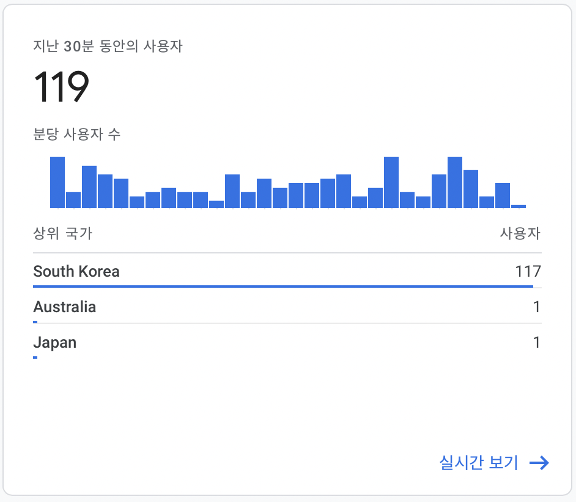
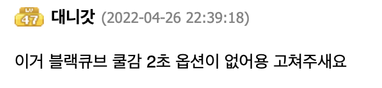
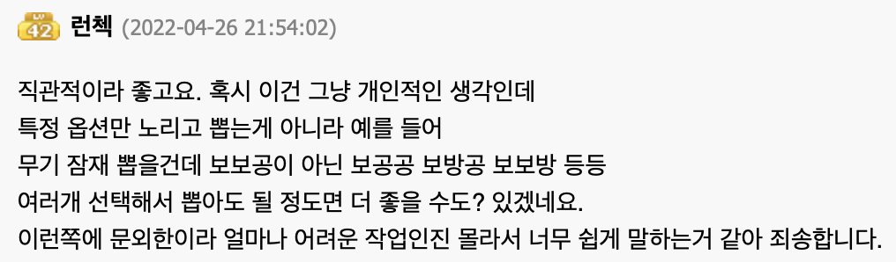
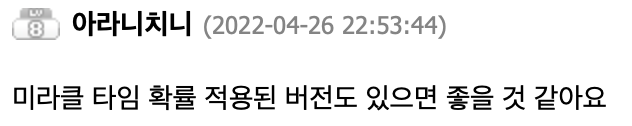

## Red vs Black : 어떤 큐브를 사용할까 ?
### 본 서비스는 온라인 게임 '메이플스토리'의 데이터를 기반으로 제공됩니다.

## Summary
1. 소개
    - Red vs Black 이란?
    - 개발 배경
    - 사용한 기술
2. 사용자 반응 및 통계
    - 서비스 공개 당시
3. 마무리

## 1. 소개
### Red vs Black 이란?
해당 서비스는 온라인 게임 '메이플스토리'에 두 가지 현금 아이템의 효율성을 각 상황에 맞게 분석하여 더 효율적인 선택지를 제공합니다.              

      
       

원하는 장비의 종류와, 현재 등급과 목표 등급을 설정하면 각 큐브를 사용 했을 때의 기대값을 계산해줍니다.  
원하는 옵션을 설정하고, 해당 옵션의 확률을 계산하여 기대값을 알려줍니다.    
사용자는 해당 결과를 바탕으로 어떤 큐브를 사용해야 효율적인지 판단 할 수 있습니다.

### 개발 배경
2021년 경, 온라인 게임의 주요 BM인 '확률형 아이템'에 대한 파문이 일었고, 이 사건을 바탕으로 많은 유저가 게임에 대한 신뢰를 잃었습니다. 이에 넥슨 측은 잘못을 인정하고 사과하며 큐브 아이템 확률에 대한 전반적인 자료를 공개하였고 이 데이터를 기반으로 계산기를 만들었습니다.    
하지만 실제로 해당 데이터를 조회하며 직접 계산 하는 것이 어렵고, 복잡했기 때문에 이를 보다 직관적으로 계산 할 수 있도록 하기 위해 서비스를 제작하게 되었습니다.

### 사용한 기술
react (npm 8.6.0)           
JS      

## 2. 사용자 반응 및 통계
서비스 공개 당시 Google analytics 를 이용하여 유입을 분석하였습니다.    

      

'메이플스토리 인벤' 커뮤니티에서 다양한 피드백이 있었고, 해당 피드백들을 바탕으로 업데이트 할 예정입니다.

   

   

    

## 3. 마무리
작성 예정입니다.

## 4. Release      

### version:1.1

- '모자 레전더리 블랙큐브' 옵션의 확률 레드큐브의 확률로 적용되고 있던 문제를 수정했습니다.